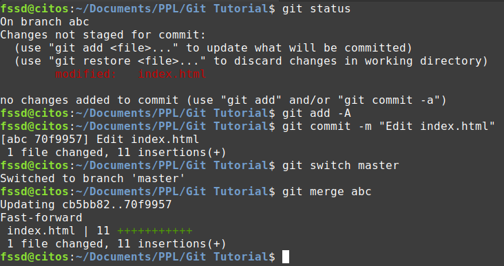

# Tutorial Git 

Git adalah salah satu sistem pengontrol versi (version control system) terdistribusi yang paling populer dalam dunia pengembangan perangkat lunak saat ini. Version control system sendiri merupakan sebuah sistem yang merekam perubahan-perubahan dari sebuah berkas atau sekumpulan berkas dari waktu ke waktu sehingga pengguna dapat memantau. Bisa dibilang Git adalah tool yang wajib dipelajari oleh seorang programmer karena sangat memudahkan dalam pengemabangan perangkat lunak. 

## Git, Github, dan Gitlab

Jika bicara tentang Git kita akan sering mendengar tentang Github ataupun Gitlab. Github dan Gitlab merupakan layanan hosting yang paling populer untuk repositori Git. Dengan menggunakan layanan Github atau Gitlab, kita dapat menyimpan repositori Git secara online dan mengaksesnya dari berbagai perangkat. Github dan Gitlab juga memfasilitasi kolaborasi tim dengan menyediakan fitur untuk melakukan manajemen proyek, merge request, pull request dan lain sebagainya 

Namun, Git sendiri adalah alat pengontrol versi yang bisa digunakan tanpa terkait dengan Github atau Gitlab, dan penggunaannya bisa dilakukan secara lokal.

## Perintah-perintah dasar Git

### Inisiasi repositori git

Untuk menginisiasi repositori git pada sebuah direktori dapat menggunakan perintah

`git init <nama direktori>`

Atau jika kita telah memiliki remote repository seperti di Gitlhub atau Gitlab, maka kita bisa melakukan clone repositori

`git clone <URL remote repository>`

### Menyimpan perubahan dengan Git

Setelah melakukan inisiasi dengan git init, sekarang kita telah memiliki repositori kosong Git. Mari kita tambahkan beberapa file di dalamnya. Misal kita akan menambahkan 3 file:

`index.html about.html contact.html`

 
Setelah menambahkan ketiga file tersebut, status pada repositori kita adalah seperti di atas. Dapat dilihat file-file tersebut masih *untracked* yang berarti riwayat perubahannya belum disimpan oleh Git. Untuk melakukannya kita memerlukan dua perintah yaitu `git add` dan `git commit`.

Perintah `git add` digunakan untuk menambahkan perubahan yang terjadi pada file atau direktori ke dalam staging area di Git sebelum melakukan commit. Dengan kata lain perintah ini digunakan untuk menandai file mana yang perubahannya akan disimpan. Penggunaan `git add` adalah sebagi berikut:

Melakukan add untuk satu file:

`git add <nama file>`

Bisa juga dengan melakukan add langsung untuk seluruh file pada directory tree:

`git add -A`

 

Setelah menandai file mana yang masuk ke staging area, kita perlu melakukan commit untuk menyimpan perubahan tersebut menggunakan `git commit`.

 `git commit -m "commit message"`

Status repositori kita setelah melakukan commit adalah sebagai berikut:

 

Perubahan yang kita buat telah berhasil disimpan oleh Git.

## Kolaborasi Tim Menggunakan Git

Seperti yang telah dijelaskan sebelumnya, Git sangat cocok digunakan untuk kolaborasi. Dengan menggunakan Github atau Gitlab sebagai layanan hosting repositori, masing-masing anggota tim dapat mengakses dan berkontribusi pada repostiori yang sama. Ada beberapa fitur git yang akan berguna dalam kolaborasi, seperti branching, pull, push, dan merge.

### Branching

Git memungkinkan kita untuk membuat branch, yaitu cabang dari repositori utama. Setiap anggota tim dapat bekerja pada branch masing-masing, sehingga tidak terjadi konflik antara perubahan yang dilakukan.

Untuk mengetahui kita berada pada branch mana dapat menggunakan perintah `git branch` atau `git status` juga dapat digunakan dalam hal ini.

 

Kita tentunya juga dapat membuat branch baru dan berpindah branch, cara melakukannya adalah dengan:

Membuat branch baru:

`git checkout -b <nama branch baru>`

Perintah sebelumnya akan langsung memindahkan kita ke branch yang baru dibuat namun untuk berpindah ke branch lain lagi dapat menggunakan:

`git checkout <nama branch>` atau `git switch <nama branch>`

Untuk melihat daftar seluruh branch yang ada di repositori, dapat menggunakan perintah `git branch -a`.

 
 

Untuk menghapus suatu branch kita dapat menggunakan perintah `git branch -d <nama branch>`

 

### Git Push

Setelah melakukan perubahan di branch lokal, kita bisa mengirimkan perubahan tersebut ke branch pada remote repository. Dengan begitu anggota tim lainnya bisa melihat perubahan yang kita buat. Untuk melakukan ini kita dapat menggunakan perintah `git push`. Ada beberapa cara dalam menggunakan `git push` yaitu:

Cara pertama:

`git push`

Kita bisa menggunakan perintah ini di branch default seperti master atau main. Namun jika kita berada di branch lain, maka kita harus mengeset upstream branch caranya adalah dengan:

`git push --set-upstream <remote repository> <nama branch di remote repository>`, misal kita ingin melakukan ke branch "abc" pada remote repository "origin":

`git push --set-upstream origin abc`

Cara Kedua:

`git push <remote repositori> <nama branch di remote repository>`

Dengan cara kedua ini kita tidak perlu mengeset upstream terlebih dahulu.

### Git Pull

`git pull` digunakan untuk mengambil perubahan dari remote repository ke repositori lokal dan menggabungkan perubahan tersebut. Sama seperti `git push` ada dua cara juga dalam menggunakan perintah ini:

Cara pertama:

`git pull`

Kita bisa langsung menggunakan `git pull` jika kita sudah mengeset upstream. 

Cara Kedua:

`git pull <remote repositori> <nama branch di remote repository>`

Dengan cara kedua ini kita tidak perlu mengeset upstream terlebih dahulu.

### Git Merge

Dalam sebuah proyek, setelah mengerjakan bagian pekerjaan kita yang terdapat pada branch lain tentu kita ingin menggabungkannya ke branch utama sehingga proyek tersebut bisa menjadi satu kesatuan yang utuh. Untuk menggabungkan branch yang satu ke branch lain kita dapat menggunakan perintah `git merge`. Sintaks biasa untuk git merge yaitu,

`git merge <branch yanng ingin digabung>`

Misal kita ingin menggabungkan perubahan pada branch "abc" ke branch "master", maka setelah melakukan commit pada branch "abc" pindah ke branch "master" lalu gunakan perintah

`git merge abc`

 

### Git Revert

Git revert adalah perintah yang digunakan untuk membatalkan commit sebelumnya dalam sebuah repositori Git. Perintah ini membuat commit baru yang membatalkan perubahan yang dilakukan oleh commit sebelumnya tanpa menghapus riwayat commit tersebut dari repositori. Syntax umum `git revert` adalah:

`git revert <Id dari commit>`

Berikut adalah contoh penggunaan git revert:

Misal kita berada pada commit `7a8ab18759a3391814f1e35eee398716ee9a661a` (Add test.txt) dan kita ingin me-revert commit `70f9957e9661e17d33f19666b8f932ccaea5fae3` (Edit index.html). Maka kita gunakan perintah `git revert 70f9957e9661e17d33f19666b8f932ccaea5fae3`

 

Hasil `git log` setelah revert adalah sebagi berikut

### Referensi

https://www.petanikode.com/git-commit/ 
https://www.petanikode.com/git-checkout-reset-revert/