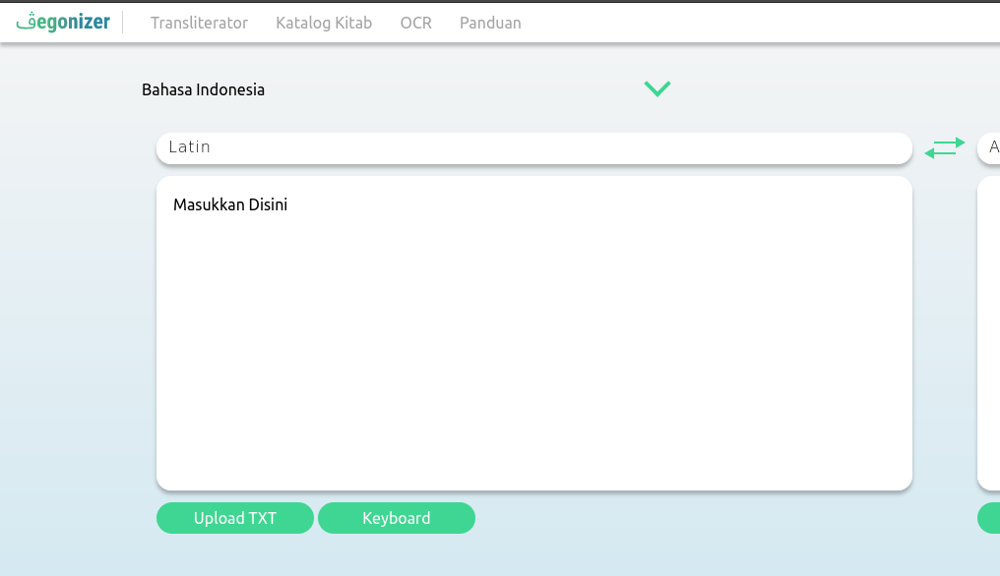

# Nielsen's 10 Usability Heuristics

Desain interaksi yang baik tentunya dapat meningkatkan pengalaman pengguna sehingga memberikan banyak keuntungan baik bagi pengguna maupun pengembang aplikasi tersebut. User experience yang baik berarti pengguna memiliki pengalaman yang berkesan terhadap aplikasi. Pengalaman tersebut dapat berupa perasaan senang, puas, seru, tertantang, termotivasi, dan perasaan lainnnya yang timbul ketika menggunakan aplikasi. Perasaan-perasaan itu dapat membuat pengguna merasa nyaman sehingga setia pada aplikasi atau bahkan mengajak pengguna-pengguna lainnya. Hal
ini tentunya akan memberikan dampak dan feedback positif bagi brand pengembang. Aplikasi yang memahami penggunaya juga akan mendapat kemudahan untuk mengembangkan fitur-fiturnya karena telah memiliki pengetahuan tentang karakteristik, kebutuhan, dan kemampuan pengguna.

Untuk memudahkan kita dalam membuat desain interaksi, kita dapat menggunakan 10 prinsip Jakob Nielsen tentang desain interaksi. Pada artikel ini akan dijelaskan mengenai 10 usabilitily heuristics menurut Nielsen. Sebagai catatan contoh-contoh gambar yang diambil bersumber dari website/software yang umum digunakan serta beberapa tugas perkuliahan.

## 1. Visibility of System Status

Sistem harus memberikan informasi secukupnya kepada pengguna tentang apa yang terjadi. Sehingga pengguna tahu tentang keadaan saat ini dan harus melakukan apa.

 

Pada contoh di atas, textbox memiliki tanda "Masukkan disini" sehingga pengguna mengerti ia dapat memberikan input pada texbox terebut.

## 2. Match Between System and The real World

Aplikasi harus memiliki desain yang membuat pengguna merasa familiar. Caranya adalah dengan menggunakan bahasa, frasa, dan konsep yang dekat dengan pengguna atau biasa pengguna gunakan.

 

Pada contoh di atas pengguna dapat dengan mudah mengerti peran dari tombol dengan dua anak panah di tengah yaitu untuk menukar bahasa.

## 3. User Control and Freedom

Pengguna bisa saja melakukan tindakan yang tidak diinginkannya secara tidak sengaja, sehingga ia membutuhkan "jalan keluar" agar dapat meninggalkan kondisi tersebut. Maka dari itu aplikasi perlu memiliki desain yang dapat meminimalisir kesalahan-kesalahan tersebut.

 

Contohnya adalah pada browser Firefox ketika kita akan menutup window, maka sistem akan memberikan konfirmasi sebelum menutup window tersebut. Dengan begitu, pengguna yang tidak sengaja menekan tombol exit dapat membatalkan tindakannya.

## 4. Consistency and Standard

Desain yang digunakan konsiten pada setiap halaman baik dari warna, elemen, jenis huruf, dan lain sebagainya. Dengan demikian pengguna tidak bingung tentang apakah desain yang berbeda memiliki arti atau fungsi yang berbeda.

  

Website Pegonizer memiliki desain tampilan yang konsisten pada setiap halaman. Hal ini akan membuat pengguna semakin familiar dengan website seiring dengan penggunaannya.

## 5. Error Prevention

Aplikasi harus memiliki desain yang mencegah pengguna melakukan kesalahan terutama pada tindakan-tindakan yang rawan kesalahan atau kekeliruan. Pencegahan error ini sendiri lebih baik dari menampilkan pesan error.

 

Form registrasi di atas memiliki kolom confirm password untuk mencegah pengguna keliru memasukkan password ketika registrasi.

## 6. Recognition Rather than Recall

Pengguna akan lebih nyaman ketika dapat melihat informasi secara langsung daripada harus mengingat tahapan-tahapan yang telah dilakukannya. Dengan begitu desain aplikasi harus memudahkan pengguna dalam melihat informasi.

 

Website Pegonizer menampilkan informasi jenis bahasa apa yang digunakan untuk transliterator sehingga pengguna tidak bingung sedang menggunakan bahasa apa.

## 7. Flexibility and Efficiency to Use

Desain aplikasi menyediakan alternatif aksi yang mengakomodir pengguna pemula dan pengguna yang suadah ahli atau biasa menggunakan aplikasi tersebut. Misalnya dengan menyediakan shortcut yang membuat penggunaan suatu fitur lebih efisien dan memudahkan user.

 

Pada browser Firefox terdapat tombol reload untuk me-refresh suatu webpage namun pengguna juga bisa menggunakan shortcut Ctrl+r.

## 8. Aesthetic and Minimalist Design

Desain aplikasi memiliki tampilan yang minimalis dalam artian tidak mengandung informasi yang tidak relevan dan jarang dibutuhkan pengguna karena akan menyulitkan pengguna untuk menangkap informasi yang lebih penting.

 

Tampilan homepage website Pegonizer cukup sederhana dengan tidak menampilkan informasi berlebih sehingga menyulitkan pengguna.

## 9. Recognize, Diagnose, and Recover From Errors

Sistem memberikan pesan error yang jelas dan mudah dimengerti pengguna. Dengan begitu pengguna bisa cepat mengetahui apa yang harus dilakukan.

 

Form login di atas memberikan pesan error yang yang mudah dimengerti ketika user salah memasukkan username atau password.

## 10. Help and Documentation

Desain aplikasi yang baik tidak membutuhkan dokumentasi tambahan. Namun dalam beberapa kasus dokumentasi mungkin memang dibutuhkan untuk membantu pengguna menyelesaikan task.

 

Website pegonizer memiliki halaman panduan tersendiri untuk membantu user menggunakan fitur-fiturnya. Terutama untuk fitur transliterator karena cara penulisan aksara Latin pada Pegonizer sedikit berbeda dengan kaidah penulisan bahasa Indonesia dan kaidah penulisan bahasa arab dengan aksara Latin pada beberapa huruf.

Referensi:

https://riyanthisianturi.com/10-usability-heuristics-jakob-nielsen/